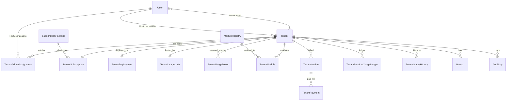
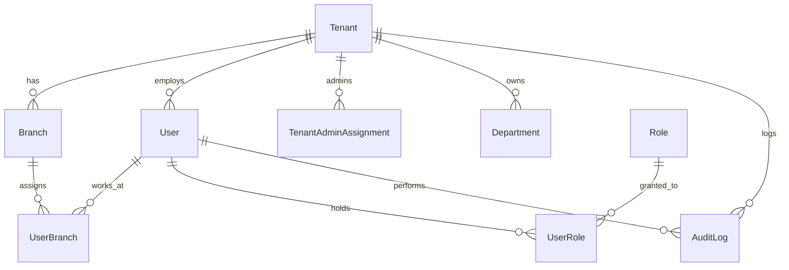
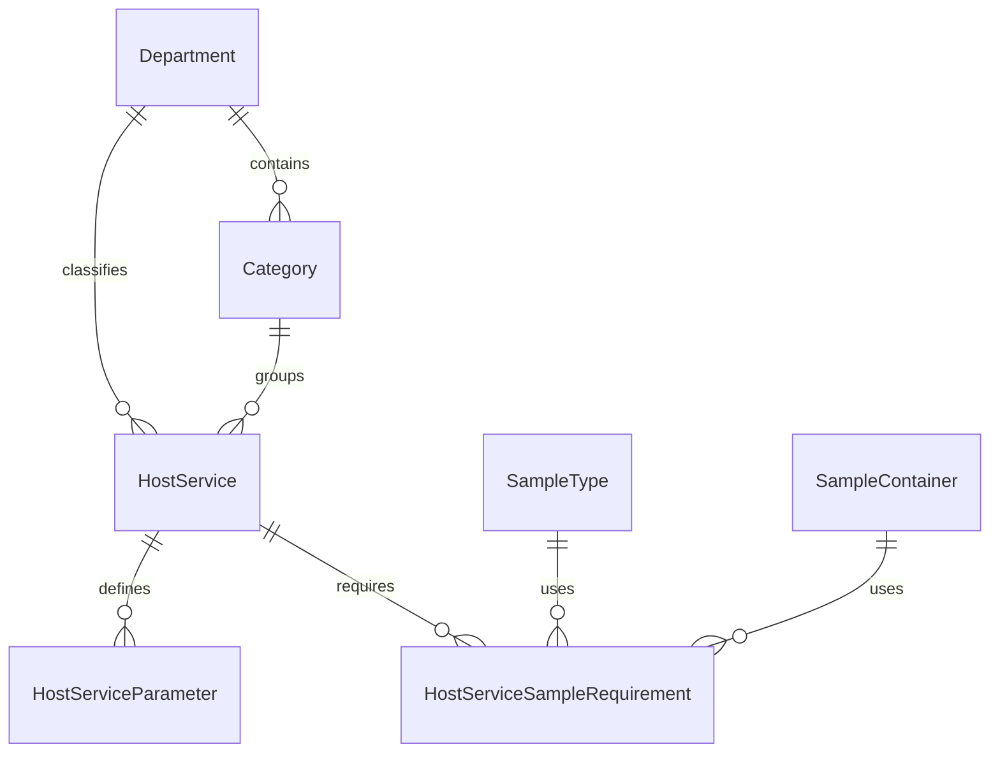
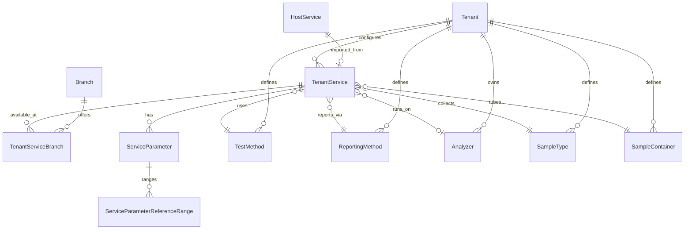
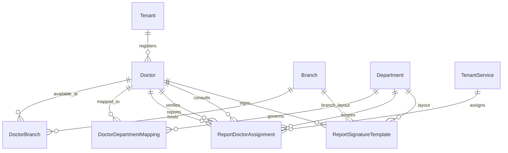
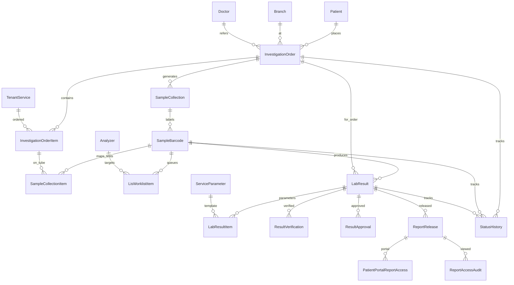

# ABSHealthcareLite — Phase 2 Diagnostic Schema Design

**Status:** Design-only (pre-freeze)  
**Date:** 2026-06-18 (rev. 2 — SaaS tenant management)  
**Scope:** Module 01 Host/Tenant SaaS Management Foundation + Diagnostic-First MVP (tenant-wise setup + LIS transaction chain)  
**Baseline:** `abs-healthcare-pilot/prisma/schema.prisma` (Tenant, Branch only)  
**Sources:** Product Book V4, Sample Data Dictionary v2, Modules 01/02/04/08/09/10/11/21/22/23/24/30, ScreenFlow & Wireframe mockups

> **Module 01 Host/Tenant SaaS Management Foundation** — Sections 2.0, 3.0, 4.0, 5.0, 6.0 (SaaS phases), 7 (SaaS questions), 9 (SaaS checklist). Diagnostic transaction schema (§2.2–2.5, §3.2–3.20) unchanged except `tenant_id` FK relationships.

---

## 1. Design Principles

| Principle | Rule |
|-----------|------|
| Tenant isolation | Every tenant-owned row carries `tenant_id`. Host/global masters use `tenant_id IS NULL`. |
| Branch awareness | Operational and master rows that vary by location carry `branch_id` (nullable only when truly tenant-wide). |
| Soft lifecycle | No physical deletes. Use `is_active` + optional `status` enum/text. |
| Audit columns | All tenant tables: `created_at`, `created_by`, `updated_at`, `updated_by`. |
| ID strategy | Prisma `cuid()` string PKs (pilot convention). Natural codes (CBC, DR-1001) as unique business keys. |
| Naming | Prisma camelCase → PostgreSQL snake_case via `@map`. |
| Host vs tenant catalog | Host publishes canonical tests; tenant imports/overrides via `TenantService` linked to `HostService`. |
| Host user scoping | `users.tenant_id IS NULL` + `is_host_admin = true` = HostUser. HostUser creates/manages tenants; tenant admins scoped to one `tenant_id`. |
| Subscription enforcement | Limits on `tenant_usage_limits`; meter on `tenant_usage_meters`; block transactions when `tenant_status` ∈ {Suspended, Expired, Archived} or subscription overdue. |
| Module gating | `tenant_modules.is_enabled` checked before module routes; Diagnostic MVP enables diagnostic modules only. |

### Standard audit block (tenant-owned)

```
tenant_id       NOT NULL  → tenants.id
branch_id       NULLABLE  → branches.id  (when applicable)
is_active       BOOLEAN   DEFAULT true
status          TEXT      NULLABLE       (transactional entities)
created_at      TIMESTAMPTZ NOT NULL
created_by      TEXT      NULLABLE       → users.id
updated_at      TIMESTAMPTZ NOT NULL
updated_by      TEXT      NULLABLE       → users.id
```

---

## 2. Updated ERD

### 2.0 Module 01 — Host/Tenant SaaS Management Foundation



**HostUser operational flow:**

```
HostUser (User.tenantId = NULL, isHostAdmin = true)
  → creates Tenant (profile + status)
  → assigns SubscriptionPackage → TenantSubscription
  → sets TenantUsageLimit (from package defaults, overridable)
  → enables TenantModule rows (ModuleRegistry)
  → creates TenantDeployment record
  → assigns TenantAdminAssignment (PrimaryAdmin)
  → issues TenantInvoice / receives TenantPayment
  → TenantStatusHistory on suspend/reactivate/archive
```

### 2.1 Foundation & Security



### 2.2 Master Taxonomy & Host Catalog



### 2.3 Tenant Diagnostic Setup



### 2.4 Doctor & Report Governance



### 2.5 Diagnostic Transaction Chain



---

## 3. Updated Table Catalog

**Legend:** `[H]` = host/global (`tenant_id` NULL) · `[T]` = tenant-scoped · `[B]` = includes `branch_id`

### 3.0 Module 01 — SaaS Tenant Management *(Req 1–10)*

#### 3.0.1 Tenant Profile / Tenant Create *(Req #1)*

Extended `tenants` table (replaces minimal pilot model). Maps Module 01 `Company` + branding header fields.

| Column | Type | Required | Notes |
|--------|------|----------|-------|
| `id` | TEXT PK | Yes | cuid |
| `tenant_code` | TEXT | Yes | UNIQUE; e.g. `ABMG` (pilot `code`) |
| `tenant_name` | TEXT | Yes | Display name (pilot `name`) |
| `short_code` | TEXT | Yes | Abbreviation |
| `legal_name` | TEXT | No | Registered entity |
| `trade_license_no` | TEXT | No | Trade license |
| `tax_bin_no` | TEXT | No | TIN/BIN (Sample Data §25) |
| `contact_person` | TEXT | Yes | Primary contact |
| `contact_mobile` | TEXT | Yes | |
| `contact_email` | TEXT | Yes | |
| `address` | TEXT | No | Street address |
| `city` | TEXT | No | |
| `district` | TEXT | No | |
| `country` | TEXT | Yes | Default `Bangladesh` |
| `timezone` | TEXT | Yes | e.g. `Asia/Dhaka` |
| `default_language` | TEXT | Yes | EN, BN, AR |
| `tenant_type` | ENUM | Yes | Diagnostic, Hospital, Clinic, Pharmacy, Mixed |
| `tenant_status` | ENUM | Yes | Trial, Active, Suspended, Expired, Archived |
| `onboarding_status` | ENUM | Yes | Draft, SetupPending, Active, Blocked |
| `logo_url` | TEXT | No | UI branding |
| `report_header_logo_url` | TEXT | No | Report header logo |
| `report_footer_text` | TEXT | No | Report footer |
| `is_active` | BOOL | Yes | Soft delete |
| `created_at/by`, `updated_at/by` | | Yes | Audit |

**Business rules (Module 01):** Suspended/Expired → no new `InvestigationOrder`. Archived → read-only. Status changes → `tenant_status_histories` + `audit_logs`.

#### 3.0.2 Tenant Deployment Info *(Req #2)*

| Table | Scope | Key columns |
|-------|-------|-------------|
| `tenant_deployments` | [T] 1:1 | tenant_id UNIQUE, deployment_mode, app_url, subdomain, custom_domain, database_name, database_schema, docker_container_name, deployment_region, environment, deployed_at, deployed_by, deployment_status, backup_policy, last_backup_at, is_active, audit |

**deployment_mode:** CloudShared, CloudDedicated, OnPremise, Hybrid  
**environment:** Dev, Staging, Production  
**deployment_status:** Pending, Deployed, Failed, Suspended

#### 3.0.3 Subscription Package Master *(Req #3)*

| Table | Scope | Key columns |
|-------|-------|-------------|
| `subscription_packages` | [H] | package_code UNIQUE, package_name, package_type, billing_cycle, monthly_fee, yearly_fee, included_branches, included_users, included_patients_per_month, included_orders_per_month, included_storage_gb, support_level, is_active, audit |

**package_type:** Trial, Starter, Standard, Professional, Enterprise  
**billing_cycle:** Monthly, Quarterly, Yearly

#### 3.0.4 Tenant Subscription *(Req #4)*

| Table | Scope | Key columns |
|-------|-------|-------------|
| `tenant_subscriptions` | [T] | tenant_id, package_id, subscription_start, subscription_end, billing_cycle, subscription_status, next_billing_date, grace_period_days, auto_renew, is_active, created_by, audit |

**subscription_status:** Trial, Active, Due, GracePeriod, Suspended, Cancelled, Expired

One **active** subscription per tenant enforced at application layer (historical rows retained).

#### 3.0.5 Module Registry & Tenant Modules *(Req #5)*

| Table | Scope | Key columns |
|-------|-------|-------------|
| `module_registry` | [H] | module_code UNIQUE, module_name, module_group, description, is_core, is_active, audit |
| `tenant_modules` | [T] | tenant_id, module_id, is_enabled, enabled_from, enabled_to, enabled_by, module_status, is_active, audit |

**module_status:** Active, Disabled, Trial, Expired

**Diagnostic MVP enabled modules (seed):**

| module_code | module_name | module_group | MVP |
|-------------|-------------|--------------|-----|
| MOD-01 | Company/Tenant | Platform | core |
| MOD-02 | User/RBAC | Platform | core |
| MOD-04 | Audit Center | Platform | core |
| MOD-08 | Department | Master | yes |
| MOD-09 | Category | Master | yes |
| MOD-10 | Service Catalog | Diagnostic | yes |
| MOD-11 | Doctor Management | Master | yes |
| MOD-15 | Patient Registration | Patient | yes |
| MOD-21 | Sample Collection | Diagnostic | yes |
| MOD-22 | Result Entry/LIS | Diagnostic | yes |
| MOD-23 | Result Verification | Diagnostic | yes |
| MOD-24 | Report Release | Diagnostic | yes |
| MOD-30 | Patient Portal | Portal | optional toggle |
| MOD-17 | Appointments | OPD | **disabled** |
| MOD-18 | Doctor Worklist | OPD | **disabled** |
| MOD-19 | Prescription | OPD | **disabled** |
| MOD-28 | IPD/Beds | IPD | **disabled** |
| MOD-20 | Pharmacy | Pharmacy | **disabled** |

#### 3.0.6 Tenant Usage Limits *(Req #6)*

| Table | Scope | Key columns |
|-------|-------|-------------|
| `tenant_usage_limits` | [T] 1:1 | tenant_id UNIQUE, max_branches, max_users, max_patients_per_month, max_orders_per_month, max_reports_per_month, max_storage_gb, max_sms_per_month, max_whatsapp_per_month, max_api_calls_per_month, allow_custom_domain, allow_api_access, allow_patient_portal, allow_multi_branch, allow_report_branding, is_active, audit |

Defaults copied from `subscription_packages` at subscription assignment; HostUser may override.

#### 3.0.7 Tenant Usage Meter *(Req #7)*

| Table | Scope | Key columns |
|-------|-------|-------------|
| `tenant_usage_meters` | [T] | tenant_id, month, year, patient_count, order_count, report_count, user_count, branch_count, storage_used_gb, sms_used, whatsapp_used, api_calls_used, calculated_at, audit |

UNIQUE `(tenant_id, year, month)`. Nightly/monthly aggregation job (backend).

#### 3.0.8 Tenant Admin Assignment *(Req #8)*

| Table | Scope | Key columns |
|-------|-------|-------------|
| `tenant_admin_assignments` | [T] | tenant_id, user_id, admin_type, assigned_by, assigned_at, is_active, audit |

**admin_type:** PrimaryAdmin, BillingAdmin, TechnicalAdmin, BranchAdmin

**Access rules:** HostUser → all tenants. PrimaryAdmin → own tenant only (no host module registry/deployment). Enforced via RBAC + `tenant_id` on session.

#### 3.0.9 Tenant Billing / Service Charge *(Req #9)*

| Table | Scope | Key columns |
|-------|-------|-------------|
| `tenant_invoices` | [T] | tenant_id, invoice_no UNIQUE per tenant, billing_period_start/end, package_id, gross_amount, discount_amount, vat_amount, net_amount, paid_amount, due_amount, invoice_status, is_active, audit |
| `tenant_payments` | [T] | tenant_id, invoice_id, payment_date, payment_method, paid_amount, transaction_ref, received_by, remarks, is_active, audit |
| `tenant_service_charge_ledger` | [T] | tenant_id, invoice_id?, debit, credit, balance, ledger_date, narration, is_active, audit |

**invoice_status:** Draft, Issued, PartiallyPaid, Paid, Overdue, Cancelled  
**payment_method:** Cash, Bank, Bkash, Nagad, Card, Online

**Suspension rule:** `invoice_status = Overdue` + grace exceeded → `tenant_status = Suspended` (via application workflow) + `tenant_status_histories`.

#### 3.0.10 Tenant Status History *(Req #10)*

| Table | Scope | Key columns |
|-------|-------|-------------|
| `tenant_status_histories` | [T] | tenant_id, old_status, new_status, reason, changed_by, changed_at, is_active |

Supports: Active, Inactive, Suspended, Expired, Archived, Reactivated (via `new_status` + reason narrative).

---

### 3.1 Foundation & Security (extended)

| Table | Scope | Purpose | Key columns |
|-------|-------|---------|-------------|
| `tenants` | Platform | **Extended SaaS profile** | See §3.0.1 |
| `branches` | [T] | Physical site | tenant_id, code, name, address, phone, email |
| `users` | [T]/Host | IAM identity | tenant_id (NULL=HostUser), username, email, password_hash, user_status, is_host_admin |
| `roles` | [T]/Host | RBAC role | tenant_id, role_name, description |
| `user_roles` | [T] | Role assignment | user_id, role_id, is_primary, effective_from |
| `user_branches` | [T] | Branch assignment | user_id, branch_id, is_primary |
| `audit_logs` | [T]/Host | Immutable audit | tenant_id, user_id, action_type, entity_type, entity_id, change_data, ip_address, user_agent |

### 3.2 Taxonomy

| Table | Scope | Purpose | Key columns |
|-------|-------|---------|-------------|
| `departments` | [H]/[T] | Clinical/admin division | tenant_id, dept_code, name, dept_type, is_active |
| `categories` | [H]/[T] | Service grouping | tenant_id, department_id, category_code, name, category_type |

### 3.3 Host Master Service / Test Catalog *(Req #1)*

| Table | Scope | Purpose | Key columns |
|-------|-------|---------|-------------|
| `host_services` | [H] | Global diagnostic catalog | department_id, category_id, service_code, service_name, short_name, is_sample_required, is_barcode_required, is_lab_test, result_mode, base_price, is_active |
| `host_service_parameters` | [H] | Default parameter skeleton | host_service_id, parameter_code, parameter_name, unit, result_type, display_order, is_active |
| `host_service_sample_requirements` | [H] | Tube grouping rules | host_service_id, sample_type_id, sample_container_id, volume_ml, is_primary |

### 3.4 Tenant Test / Service Setup *(Req #2)*

| Table | Scope | Purpose | Key columns |
|-------|-------|---------|-------------|
| `tenant_services` | [T] | Tenant-local test config | tenant_id, host_service_id, local_name, department_id, category_id, sample_type_id, sample_container_id, price, discount_allowed, effective_from, effective_to, test_method_id, reporting_method_id, analyzer_id, is_barcode_required, tat_hours, is_active |
| `tenant_service_branches` | [T][B] | Branch availability | tenant_id, tenant_service_id, branch_id, is_active |

Parameters and reference ranges are tenant-owned (may override host defaults):

| Table | Scope | Purpose | Key columns |
|-------|-------|---------|-------------|
| `service_parameters` | [T] | Test parameters | tenant_id, tenant_service_id, parameter_code, parameter_name, unit, result_type, formula, display_order, is_active |
| `service_parameter_reference_ranges` | [T] | Age/gender ranges | tenant_id, service_parameter_id, gender, age_from_days, age_to_days, normal_low, normal_high, critical_low, critical_high, text_range, is_active |

### 3.5 Test Method Master *(Req #3)*

| Table | Scope | Purpose | Key columns |
|-------|-------|---------|-------------|
| `test_methods` | [T][B] | Manual, ELISA, CLIA, etc. | tenant_id, branch_id, department_id, method_code, method_name, is_active |

**Seed codes:** MANUAL, AUTOMATED, ELISA, CLIA, MICROSCOPY, HPLC, CULTURE, IMAGING, OUTSOURCED

### 3.6 Machine / Analyzer Master *(Req #4)*

| Table | Scope | Purpose | Key columns |
|-------|-------|---------|-------------|
| `analyzers` | [T][B] | Lab/radiology machines | tenant_id, branch_id, department_id, analyzer_code, machine_name, model, manufacturer, interface_type, protocol, is_active |

**interface_type examples:** HL7, ASTM, Manual, DICOM (future), Middleware

### 3.7 Reporting Method Master *(Req #5)*

| Table | Scope | Purpose | Key columns |
|-------|-------|---------|-------------|
| `reporting_methods` | [T]/[H] | How report is produced | tenant_id, method_code, method_name, description, is_active |

**Seed codes:** MANUAL_REPORT, ANALYZER_IMPORTED, TEMPLATE_BASED, FORMULA_BASED, OUTSOURCED, RADIOLOGY_NARRATIVE

### 3.8 Sample / Tube / Container Setup *(Req #6)*

| Table | Scope | Purpose | Key columns |
|-------|-------|---------|-------------|
| `sample_types` | [H]/[T] | Blood, Urine, etc. | tenant_id, type_code, sample_type, is_active |
| `sample_containers` | [H]/[T] | Tube/container master | tenant_id, department_id, container_code, container_type, tube_color, collection_instruction, barcode_required, sample_required, volume_ml, transport_temperature, is_active |

### 3.9 Doctor Master *(Req #8)*

| Table | Scope | Purpose | Key columns |
|-------|-------|---------|-------------|
| `doctors` | [T] | Provider registry | tenant_id, doctor_code, doctor_name, degree, specialty, department_id, bmdc_no, phone, email, signature_image_url, seal_image_url, is_referring, is_reporting, is_verifying, is_consultant, is_pathologist, is_radiologist, commission_applicable, consultation_fee, user_id, is_active |
| `doctor_branches` | [T][B] | Branch availability | tenant_id, doctor_id, branch_id, is_primary, is_active |

### 3.10 Doctor Department Mapping *(Req #9)*

| Table | Scope | Purpose | Key columns |
|-------|-------|---------|-------------|
| `doctor_department_mappings` | [T] | Dept-level privileges | tenant_id, doctor_id, department_id, can_report, can_verify, can_release, is_active |

### 3.11 Report Doctor Assignment *(Req #10)*

| Table | Scope | Purpose | Key columns |
|-------|-------|---------|-------------|
| `report_doctor_assignments` | [T][B] | Per test/dept doctors | tenant_id, branch_id, tenant_service_id, department_id, reporting_doctor_id, verifying_doctor_id, consultant_doctor_id, default_for_report, effective_from, effective_to, is_active |

**Resolution order at runtime:** branch+service → branch+department → tenant+department default → doctor role flags.

### 3.12 Report Signature Template *(Req #11)*

| Table | Scope | Purpose | Key columns |
|-------|-------|---------|-------------|
| `report_signature_templates` | [T][B] | Print/sign layout | tenant_id, branch_id, department_id, doctor_id, signature_position, show_degree, show_bmdc, show_seal, footer_text, is_active |

### 3.13 Patient *(transaction prerequisite)*

| Table | Scope | Purpose | Key columns |
|-------|-------|---------|-------------|
| `patients` | [T] | MPI | tenant_id, patient_code, first_name, last_name, dob, gender, blood_group, phone, email, nid, status, is_active |
| `patient_addresses` | [T] | Address | tenant_id, patient_id, address_type, city, country |
| `patient_guardians` | [T] | Guardian | tenant_id, patient_id, name, relation, phone |

### 3.14 Investigation & Billing Header

| Table | Scope | Purpose | Key columns |
|-------|-------|---------|-------------|
| `investigation_orders` | [T][B] | Diagnostic order/bill | tenant_id, branch_id, order_no, patient_id, referring_doctor_id, encounter_id, order_date, total_amount, discount_amount, paid_amount, due_amount, payment_status, status, is_active |
| `investigation_order_items` | [T][B] | Line items | tenant_id, branch_id, order_id, tenant_service_id, service_name_snapshot, unit_price, discount, quantity, line_total, status |

### 3.15 Sample Collection *(Module 21)*

| Table | Scope | Purpose | Key columns |
|-------|-------|---------|-------------|
| `sample_collections` | [T][B] | Collection header | tenant_id, branch_id, order_id, patient_id, total_samples, status |
| `sample_barcodes` | [T][B] | Physical tube | tenant_id, branch_id, collection_id, barcode_no, sample_type_id, sample_container_id, department_id, status, collected_by, collected_at, received_by, received_at |
| `sample_collection_items` | [T] | Test-to-tube map | tenant_id, barcode_id, order_item_id |
| `sample_rejections` | [T] | Rejection audit | tenant_id, barcode_id, reason, remarks, rejected_by, rejected_at, is_recollected |

### 3.16 LIS / Analyzer Queue *(Module 22)*

| Table | Scope | Purpose | Key columns |
|-------|-------|---------|-------------|
| `lis_worklist_items` | [T][B] | Dept worklist | tenant_id, branch_id, barcode_id, order_item_id, department_id, analyzer_id, lis_status, machine_sample_id, sent_at, received_at |
| `analyzer_import_queue` | [T] | Raw import | tenant_id, branch_id, analyzer_id, machine_sample_id, raw_payload, processed_status, error_message |
| `analyzer_mappings` | [T] | Machine code map | tenant_id, analyzer_id, machine_test_code, service_parameter_id |

### 3.17 Results *(Module 22)*

| Table | Scope | Purpose | Key columns |
|-------|-------|---------|-------------|
| `lab_results` | [T][B] | Result header | tenant_id, branch_id, order_id, order_item_id, patient_id, barcode_id, department_id, status, entered_by, entered_at, validated_by, validated_at |
| `lab_result_items` | [T] | Parameter values | tenant_id, result_id, service_parameter_id, result_value, result_flag, result_source, analyzer_id, is_active |
| `lab_result_versions` | [T] | Correction history | tenant_id, result_item_id, old_value, new_value, reason, approved_by |
| `critical_value_alerts` | [T] | Panic workflow | tenant_id, result_item_id, alert_time, notified_to, notified_by, acknowledged_by, acknowledged_at |

### 3.18 Verification *(Module 23)*

| Table | Scope | Purpose | Key columns |
|-------|-------|---------|-------------|
| `result_verifications` | [T][B] | Tech verification | tenant_id, branch_id, result_id, verification_level, verified_by, verified_at, status, remarks |
| `result_verification_checklists` | [T] | Checklist items | tenant_id, verification_id, check_item, is_checked |
| `result_approvals` | [T][B] | Pathologist approval | tenant_id, branch_id, result_id, approved_by, approved_at, doctor_id, digital_signature_ref |
| `result_holds` | [T] | Release blocks | tenant_id, result_id, hold_type, placed_by, placed_at, released_by, released_at |

### 3.19 Report Release & Portal *(Modules 24, 30)*

| Table | Scope | Purpose | Key columns |
|-------|-------|---------|-------------|
| `report_releases` | [T][B] | Release record | tenant_id, branch_id, result_id, order_id, status, released_by, released_at, report_no, qr_token |
| `report_deliveries` | [T] | Delivery channel | tenant_id, release_id, delivery_method, delivered_to, delivered_by, delivered_at |
| `report_access_audits` | [T] | View/download log | tenant_id, release_id, accessed_by, access_method, access_time, ip_address |
| `patient_portal_report_access` | [T] | Portal visibility | tenant_id, patient_id, release_id, is_visible, first_viewed_at, document_access_level |
| `report_verification_links` | [T] | QR authenticity | tenant_id, release_id, verification_token, expiry_date, is_revoked |

### 3.20 Status History (generic)

| Table | Scope | Purpose | Key columns |
|-------|-------|---------|-------------|
| `status_histories` | [T] | Polymorphic trail | tenant_id, entity_type, entity_id, old_status, new_status, changed_by, changed_at, remarks |

**entity_type values:** InvestigationOrder, SampleBarcode, LabResult, ReportRelease

---

## 4. Updated Prisma Model Catalog

> **Note:** Design artifact for schema freeze. Not migrated. Maps 1:1 to Section 3 tables.

### 4.1 Enums

```prisma
// ── Module 01 SaaS ──
enum TenantType {
  DIAGNOSTIC
  HOSPITAL
  CLINIC
  PHARMACY
  MIXED
}

enum TenantStatus {
  TRIAL
  ACTIVE
  SUSPENDED
  EXPIRED
  ARCHIVED
}

enum OnboardingStatus {
  DRAFT
  SETUP_PENDING
  ACTIVE
  BLOCKED
}

enum DeploymentMode {
  CLOUD_SHARED
  CLOUD_DEDICATED
  ON_PREMISE
  HYBRID
}

enum DeploymentEnvironment {
  DEV
  STAGING
  PRODUCTION
}

enum DeploymentStatus {
  PENDING
  DEPLOYED
  FAILED
  SUSPENDED
}

enum PackageType {
  TRIAL
  STARTER
  STANDARD
  PROFESSIONAL
  ENTERPRISE
}

enum BillingCycle {
  MONTHLY
  QUARTERLY
  YEARLY
}

enum SubscriptionStatus {
  TRIAL
  ACTIVE
  DUE
  GRACE_PERIOD
  SUSPENDED
  CANCELLED
  EXPIRED
}

enum TenantModuleStatus {
  ACTIVE
  DISABLED
  TRIAL
  EXPIRED
}

enum TenantAdminType {
  PRIMARY_ADMIN
  BILLING_ADMIN
  TECHNICAL_ADMIN
  BRANCH_ADMIN
}

enum TenantInvoiceStatus {
  DRAFT
  ISSUED
  PARTIALLY_PAID
  PAID
  OVERDUE
  CANCELLED
}

enum TenantPaymentMethod {
  CASH
  BANK
  BKASH
  NAGAD
  CARD
  ONLINE
}

// ── Diagnostic / Clinical ──
enum EntityStatus {
  ACTIVE
  INACTIVE
  ARCHIVED
}

enum OrderStatus {
  ORDERED
  PENDING_COLLECTION
  COLLECTED
  IN_LAB
  RESULT_PENDING
  VERIFICATION_PENDING
  APPROVED
  RELEASE_PENDING
  RELEASED
  CANCELLED
}

enum SampleStatus {
  ORDERED
  PENDING_COLLECTION
  COLLECTED
  IN_TRANSIT
  RECEIVED
  PROCESSING
  COMPLETED
  REJECTED
  RECOLLECTION_REQUIRED
  CANCELLED
}

enum ResultStatus {
  PENDING
  DRAFT
  ENTERED
  VALIDATED
  VERIFICATION_PENDING
  APPROVED
  CORRECTED
  REJECTED
}

enum ResultType {
  NUMERIC
  TEXT
  LONG_TEXT
  BOOLEAN
  OPTION_LIST
  CULTURE
  NARRATIVE
  CALCULATED
}

enum ResultSource {
  MANUAL
  ANALYZER_IMPORT
  CALCULATED
  EXTERNAL_API
}

enum LisStatus {
  PENDING_SEND
  SENT_TO_ANALYZER
  RESULT_RECEIVED
  ERROR
  MANUAL_FALLBACK
}

enum ReleaseStatus {
  RELEASE_PENDING
  RELEASED
  REVOKED
  REPRINTED
  CORRECTED_AFTER_RELEASE
}

enum AuditActionType {
  INSERT
  UPDATE
  DELETE
  LOGIN
  LOGOUT
  VIEW
  PRINT
  RELEASE
}
```

### 4.2 Core models (abbreviated — full field list in Section 3)

#### 4.2.1 Module 01 — SaaS models

```prisma
model Tenant {
  id                    String           @id @default(cuid())
  tenantCode            String           @unique @map("tenant_code")
  tenantName            String           @map("tenant_name")
  shortCode             String           @map("short_code")
  legalName             String?          @map("legal_name")
  tradeLicenseNo        String?          @map("trade_license_no")
  taxBinNo              String?          @map("tax_bin_no")
  contactPerson         String           @map("contact_person")
  contactMobile         String           @map("contact_mobile")
  contactEmail          String           @map("contact_email")
  address               String?
  city                  String?
  district              String?
  country               String
  timezone              String
  defaultLanguage       String           @map("default_language")
  tenantType            TenantType       @map("tenant_type")
  tenantStatus          TenantStatus     @map("tenant_status")
  onboardingStatus      OnboardingStatus @map("onboarding_status")
  logoUrl               String?          @map("logo_url")
  reportHeaderLogoUrl   String?          @map("report_header_logo_url")
  reportFooterText      String?          @map("report_footer_text")
  isActive              Boolean          @default(true) @map("is_active")
  createdAt             DateTime         @default(now()) @map("created_at")
  createdBy             String?          @map("created_by")
  updatedAt             DateTime         @updatedAt @map("updated_at")
  updatedBy             String?          @map("updated_by")

  branches              Branch[]
  deployment            TenantDeployment?
  subscriptions         TenantSubscription[]
  usageLimit            TenantUsageLimit?
  usageMeters           TenantUsageMeter[]
  modules               TenantModule[]
  adminAssignments      TenantAdminAssignment[]
  invoices              TenantInvoice[]
  payments              TenantPayment[]
  ledgerEntries         TenantServiceChargeLedger[]
  statusHistories       TenantStatusHistory[]
  // … diagnostic relations unchanged

  @@map("tenants")
}

model TenantDeployment {
  id                  String                @id @default(cuid())
  tenantId            String                @unique @map("tenant_id")
  deploymentMode      DeploymentMode        @map("deployment_mode")
  appUrl              String?               @map("app_url")
  subdomain           String?
  customDomain        String?               @map("custom_domain")
  databaseName        String?               @map("database_name")
  databaseSchema      String?               @map("database_schema")
  dockerContainerName String?               @map("docker_container_name")
  deploymentRegion    String?               @map("deployment_region")
  environment         DeploymentEnvironment
  deployedAt          DateTime?             @map("deployed_at")
  deployedBy          String?               @map("deployed_by")
  deploymentStatus    DeploymentStatus      @map("deployment_status")
  backupPolicy        String?               @map("backup_policy")
  lastBackupAt        DateTime?             @map("last_backup_at")
  isActive            Boolean               @default(true) @map("is_active")
  createdAt           DateTime              @default(now()) @map("created_at")
  createdBy           String?               @map("created_by")
  updatedAt           DateTime              @updatedAt @map("updated_at")
  updatedBy           String?               @map("updated_by")

  tenant              Tenant                @relation(fields: [tenantId], references: [id], onDelete: Cascade)

  @@map("tenant_deployments")
}

model SubscriptionPackage {
  id                        String       @id @default(cuid())
  packageCode               String       @unique @map("package_code")
  packageName               String       @map("package_name")
  packageType               PackageType  @map("package_type")
  billingCycle              BillingCycle @map("billing_cycle")
  monthlyFee                Decimal      @map("monthly_fee") @db.Decimal(18, 2)
  yearlyFee                 Decimal      @map("yearly_fee") @db.Decimal(18, 2)
  includedBranches          Int          @map("included_branches")
  includedUsers             Int          @map("included_users")
  includedPatientsPerMonth  Int          @map("included_patients_per_month")
  includedOrdersPerMonth    Int          @map("included_orders_per_month")
  includedStorageGb         Int          @map("included_storage_gb")
  supportLevel              String       @map("support_level")
  isActive                  Boolean      @default(true) @map("is_active")
  createdAt                 DateTime     @default(now()) @map("created_at")
  createdBy                 String?      @map("created_by")
  updatedAt                 DateTime     @updatedAt @map("updated_at")
  updatedBy                 String?      @map("updated_by")

  subscriptions             TenantSubscription[]
  invoices                  TenantInvoice[]

  @@map("subscription_packages")
}

model TenantSubscription {
  id                 String             @id @default(cuid())
  tenantId           String             @map("tenant_id")
  packageId          String             @map("package_id")
  subscriptionStart  DateTime           @map("subscription_start")
  subscriptionEnd    DateTime           @map("subscription_end")
  billingCycle       BillingCycle       @map("billing_cycle")
  subscriptionStatus SubscriptionStatus @map("subscription_status")
  nextBillingDate    DateTime?          @map("next_billing_date")
  gracePeriodDays    Int                @default(7) @map("grace_period_days")
  autoRenew          Boolean            @default(true) @map("auto_renew")
  isActive           Boolean            @default(true) @map("is_active")
  createdAt          DateTime           @default(now()) @map("created_at")
  createdBy          String?            @map("created_by")
  updatedAt          DateTime           @updatedAt @map("updated_at")
  updatedBy          String?            @map("updated_by")

  tenant             Tenant             @relation(fields: [tenantId], references: [id], onDelete: Cascade)
  package            SubscriptionPackage @relation(fields: [packageId], references: [id])

  @@index([tenantId, subscriptionStatus])
  @@map("tenant_subscriptions")
}

model ModuleRegistry {
  id           String   @id @default(cuid())
  moduleCode   String   @unique @map("module_code")
  moduleName   String   @map("module_name")
  moduleGroup  String   @map("module_group")
  description  String?
  isCore       Boolean  @default(false) @map("is_core")
  isActive     Boolean  @default(true) @map("is_active")
  createdAt    DateTime @default(now()) @map("created_at")
  createdBy    String?  @map("created_by")
  updatedAt    DateTime @updatedAt @map("updated_at")
  updatedBy    String?  @map("updated_by")

  tenantModules TenantModule[]

  @@map("module_registry")
}

model TenantModule {
  id           String             @id @default(cuid())
  tenantId     String             @map("tenant_id")
  moduleId     String             @map("module_id")
  isEnabled    Boolean            @default(true) @map("is_enabled")
  enabledFrom  DateTime           @map("enabled_from")
  enabledTo    DateTime?          @map("enabled_to")
  enabledBy    String?            @map("enabled_by")
  moduleStatus TenantModuleStatus @map("module_status")
  isActive     Boolean            @default(true) @map("is_active")
  createdAt    DateTime           @default(now()) @map("created_at")
  createdBy    String?            @map("created_by")
  updatedAt    DateTime           @updatedAt @map("updated_at")
  updatedBy    String?            @map("updated_by")

  tenant       Tenant             @relation(fields: [tenantId], references: [id], onDelete: Cascade)
  module       ModuleRegistry     @relation(fields: [moduleId], references: [id])

  @@unique([tenantId, moduleId])
  @@map("tenant_modules")
}

model TenantUsageLimit {
  id                    String   @id @default(cuid())
  tenantId              String   @unique @map("tenant_id")
  maxBranches           Int      @map("max_branches")
  maxUsers              Int      @map("max_users")
  maxPatientsPerMonth   Int      @map("max_patients_per_month")
  maxOrdersPerMonth     Int      @map("max_orders_per_month")
  maxReportsPerMonth    Int      @map("max_reports_per_month")
  maxStorageGb          Int      @map("max_storage_gb")
  maxSmsPerMonth        Int      @map("max_sms_per_month")
  maxWhatsappPerMonth   Int      @map("max_whatsapp_per_month")
  maxApiCallsPerMonth   Int      @map("max_api_calls_per_month")
  allowCustomDomain     Boolean  @default(false) @map("allow_custom_domain")
  allowApiAccess        Boolean  @default(false) @map("allow_api_access")
  allowPatientPortal    Boolean  @default(false) @map("allow_patient_portal")
  allowMultiBranch      Boolean  @default(false) @map("allow_multi_branch")
  allowReportBranding   Boolean  @default(true) @map("allow_report_branding")
  isActive              Boolean  @default(true) @map("is_active")
  createdAt             DateTime @default(now()) @map("created_at")
  createdBy             String?  @map("created_by")
  updatedAt             DateTime @updatedAt @map("updated_at")
  updatedBy             String?  @map("updated_by")

  tenant                Tenant   @relation(fields: [tenantId], references: [id], onDelete: Cascade)

  @@map("tenant_usage_limits")
}

model TenantUsageMeter {
  id              String   @id @default(cuid())
  tenantId        String   @map("tenant_id")
  month           Int
  year            Int
  patientCount    Int      @default(0) @map("patient_count")
  orderCount      Int      @default(0) @map("order_count")
  reportCount     Int      @default(0) @map("report_count")
  userCount       Int      @default(0) @map("user_count")
  branchCount     Int      @default(0) @map("branch_count")
  storageUsedGb   Decimal  @default(0) @map("storage_used_gb") @db.Decimal(10, 2)
  smsUsed         Int      @default(0) @map("sms_used")
  whatsappUsed    Int      @default(0) @map("whatsapp_used")
  apiCallsUsed    Int      @default(0) @map("api_calls_used")
  calculatedAt    DateTime @map("calculated_at")
  createdAt       DateTime @default(now()) @map("created_at")
  createdBy       String?  @map("created_by")
  updatedAt       DateTime @updatedAt @map("updated_at")
  updatedBy       String?  @map("updated_by")

  tenant          Tenant   @relation(fields: [tenantId], references: [id], onDelete: Cascade)

  @@unique([tenantId, year, month])
  @@map("tenant_usage_meters")
}

model TenantAdminAssignment {
  id          String          @id @default(cuid())
  tenantId    String          @map("tenant_id")
  userId      String          @map("user_id")
  adminType   TenantAdminType @map("admin_type")
  assignedBy  String          @map("assigned_by")
  assignedAt  DateTime        @map("assigned_at")
  isActive    Boolean         @default(true) @map("is_active")
  createdAt   DateTime        @default(now()) @map("created_at")
  createdBy   String?         @map("created_by")
  updatedAt   DateTime        @updatedAt @map("updated_at")
  updatedBy   String?         @map("updated_by")

  tenant      Tenant          @relation(fields: [tenantId], references: [id], onDelete: Cascade)
  user        User            @relation(fields: [userId], references: [id])

  @@unique([tenantId, userId, adminType])
  @@map("tenant_admin_assignments")
}

model TenantInvoice {
  id                  String              @id @default(cuid())
  tenantId            String              @map("tenant_id")
  invoiceNo           String              @map("invoice_no")
  billingPeriodStart  DateTime            @map("billing_period_start")
  billingPeriodEnd    DateTime            @map("billing_period_end")
  packageId           String              @map("package_id")
  grossAmount         Decimal             @map("gross_amount") @db.Decimal(18, 2)
  discountAmount      Decimal             @default(0) @map("discount_amount") @db.Decimal(18, 2)
  vatAmount           Decimal             @default(0) @map("vat_amount") @db.Decimal(18, 2)
  netAmount           Decimal             @map("net_amount") @db.Decimal(18, 2)
  paidAmount          Decimal             @default(0) @map("paid_amount") @db.Decimal(18, 2)
  dueAmount           Decimal             @map("due_amount") @db.Decimal(18, 2)
  invoiceStatus       TenantInvoiceStatus @map("invoice_status")
  isActive            Boolean             @default(true) @map("is_active")
  createdAt           DateTime            @default(now()) @map("created_at")
  createdBy           String?             @map("created_by")
  updatedAt           DateTime            @updatedAt @map("updated_at")
  updatedBy           String?             @map("updated_by")

  tenant              Tenant              @relation(fields: [tenantId], references: [id], onDelete: Cascade)
  package             SubscriptionPackage @relation(fields: [packageId], references: [id])
  payments            TenantPayment[]
  ledgerEntries       TenantServiceChargeLedger[]

  @@unique([tenantId, invoiceNo])
  @@map("tenant_invoices")
}

model TenantPayment {
  id            String              @id @default(cuid())
  tenantId      String              @map("tenant_id")
  invoiceId     String              @map("invoice_id")
  paymentDate   DateTime            @map("payment_date")
  paymentMethod TenantPaymentMethod @map("payment_method")
  paidAmount    Decimal             @map("paid_amount") @db.Decimal(18, 2)
  transactionRef String?            @map("transaction_ref")
  receivedBy    String?             @map("received_by")
  remarks       String?
  isActive      Boolean             @default(true) @map("is_active")
  createdAt     DateTime            @default(now()) @map("created_at")
  createdBy     String?             @map("created_by")
  updatedAt     DateTime            @updatedAt @map("updated_at")
  updatedBy     String?             @map("updated_by")

  tenant        Tenant              @relation(fields: [tenantId], references: [id], onDelete: Cascade)
  invoice       TenantInvoice       @relation(fields: [invoiceId], references: [id])

  @@map("tenant_payments")
}

model TenantServiceChargeLedger {
  id          String    @id @default(cuid())
  tenantId    String    @map("tenant_id")
  invoiceId   String?   @map("invoice_id")
  debit       Decimal   @default(0) @db.Decimal(18, 2)
  credit      Decimal   @default(0) @db.Decimal(18, 2)
  balance     Decimal   @db.Decimal(18, 2)
  ledgerDate  DateTime  @map("ledger_date")
  narration   String?
  isActive    Boolean   @default(true) @map("is_active")
  createdAt   DateTime  @default(now()) @map("created_at")
  createdBy   String?   @map("created_by")
  updatedAt   DateTime  @updatedAt @map("updated_at")
  updatedBy   String?   @map("updated_by")

  tenant      Tenant    @relation(fields: [tenantId], references: [id], onDelete: Cascade)
  invoice     TenantInvoice? @relation(fields: [invoiceId], references: [id])

  @@index([tenantId, ledgerDate])
  @@map("tenant_service_charge_ledger")
}

model TenantStatusHistory {
  id         String       @id @default(cuid())
  tenantId   String       @map("tenant_id")
  oldStatus  TenantStatus @map("old_status")
  newStatus  TenantStatus @map("new_status")
  reason     String?
  changedBy  String       @map("changed_by")
  changedAt  DateTime     @map("changed_at")
  isActive   Boolean      @default(true) @map("is_active")

  tenant     Tenant       @relation(fields: [tenantId], references: [id], onDelete: Cascade)

  @@index([tenantId, changedAt])
  @@map("tenant_status_histories")
}
```

#### 4.2.2 Diagnostic & clinical models

```prisma
model Branch { ... }          // exists — add tenant relation to extended Tenant

model User {
  id, tenantId?, username, email, passwordHash, userStatus, isHostAdmin, isActive
  createdAt, createdBy, updatedAt, updatedBy
  // HostUser: tenantId = null, isHostAdmin = true
}

model Department {
  id, tenantId?, deptCode, name, deptType, isActive
  createdAt, createdBy, updatedAt, updatedBy
}

model Category {
  id, tenantId?, departmentId, categoryCode, name, categoryType, isActive
  createdAt, createdBy, updatedAt, updatedBy
}

model HostService {
  id, departmentId, categoryId, serviceCode, serviceName, shortName
  isSampleRequired, isBarcodeRequired, isLabTest, resultMode, basePrice, isActive
  createdAt, createdBy, updatedAt, updatedBy
}

model TenantService {
  id, tenantId, hostServiceId?, localName, departmentId, categoryId
  sampleTypeId?, sampleContainerId?, price, discountAllowed
  effectiveFrom, effectiveTo?, testMethodId?, reportingMethodId?, analyzerId?
  isBarcodeRequired, tatHours?, isActive
  createdAt, createdBy, updatedAt, updatedBy
}

model TenantServiceBranch {
  id, tenantId, tenantServiceId, branchId, isActive
  createdAt, createdBy, updatedAt, updatedBy
}

model TestMethod {
  id, tenantId, branchId?, departmentId?, methodCode, methodName, isActive
  createdAt, createdBy, updatedAt, updatedBy
}

model ReportingMethod {
  id, tenantId?, methodCode, methodName, description?, isActive
  createdAt, createdBy, updatedAt, updatedBy
}

model Analyzer {
  id, tenantId, branchId, departmentId, analyzerCode, machineName
  model?, manufacturer?, interfaceType, protocol?, isActive
  createdAt, createdBy, updatedAt, updatedBy
}

model SampleType {
  id, tenantId?, typeCode, sampleType, isActive
  createdAt, createdBy, updatedAt, updatedBy
}

model SampleContainer {
  id, tenantId?, departmentId?, containerCode, containerType, tubeColor
  collectionInstruction?, barcodeRequired, sampleRequired, volumeMl?, transportTemperature?, isActive
  createdAt, createdBy, updatedAt, updatedBy
}

model ServiceParameter {
  id, tenantId, tenantServiceId, parameterCode, parameterName, unit?
  resultType, formula?, displayOrder, isActive
  createdAt, createdBy, updatedAt, updatedBy
}

model ServiceParameterReferenceRange {
  id, tenantId, serviceParameterId, gender?, ageFromDays?, ageToDays?
  normalLow?, normalHigh?, criticalLow?, criticalHigh?, textRange?, isActive
  createdAt, createdBy, updatedAt, updatedBy
}

model Doctor {
  id, tenantId, doctorCode, doctorName, degree?, specialty?, departmentId
  bmdcNo?, phone?, email?, signatureImageUrl?, sealImageUrl?
  isReferring, isReporting, isVerifying, isConsultant, isPathologist, isRadiologist
  commissionApplicable, consultationFee?, userId?, isActive
  createdAt, createdBy, updatedAt, updatedBy
}

model DoctorBranch {
  id, tenantId, doctorId, branchId, isPrimary, isActive
  createdAt, createdBy, updatedAt, updatedBy
}

model DoctorDepartmentMapping {
  id, tenantId, doctorId, departmentId
  canReport, canVerify, canRelease, isActive
  createdAt, createdBy, updatedAt, updatedBy
}

model ReportDoctorAssignment {
  id, tenantId, branchId?, tenantServiceId?, departmentId
  reportingDoctorId?, verifyingDoctorId?, consultantDoctorId?
  defaultForReport, effectiveFrom, effectiveTo?, isActive
  createdAt, createdBy, updatedAt, updatedBy
}

model ReportSignatureTemplate {
  id, tenantId, branchId?, departmentId?, doctorId
  signaturePosition, showDegree, showBmdc, showSeal, footerText?, isActive
  createdAt, createdBy, updatedAt, updatedBy
}

model Patient { ... }
model InvestigationOrder { ... }
model InvestigationOrderItem { ... }
model SampleCollection { ... }
model SampleBarcode { ... }
model SampleCollectionItem { ... }
model LisWorklistItem { ... }
model LabResult { ... }
model LabResultItem { ... }
model ResultVerification { ... }
model ResultApproval { ... }
model ReportRelease { ... }
model PatientPortalReportAccess { ... }
model AuditLog { ... }
model StatusHistory { ... }
```

### 4.3 Index strategy (PostgreSQL)

| Table | Indexes |
|-------|---------|
| All tenant tables | `(tenant_id)`, `(tenant_id, is_active)` |
| `tenants` | UNIQUE `(tenant_code)` |
| `tenant_subscriptions` | `(tenant_id, subscription_status)` |
| `tenant_modules` | UNIQUE `(tenant_id, module_id)` |
| `tenant_usage_meters` | UNIQUE `(tenant_id, year, month)` |
| `tenant_invoices` | UNIQUE `(tenant_id, invoice_no)`, `(invoice_status)` |
| `tenant_status_histories` | `(tenant_id, changed_at DESC)` |
| `module_registry` | UNIQUE `(module_code)` |
| `subscription_packages` | UNIQUE `(package_code)` |
| Branch-scoped | `(tenant_id, branch_id, status)` |
| `host_services` | UNIQUE `(service_code)` |
| `tenant_services` | UNIQUE `(tenant_id, host_service_id)` where host_service_id NOT NULL |
| `sample_barcodes` | UNIQUE `(tenant_id, barcode_no)` |
| `investigation_orders` | UNIQUE `(tenant_id, order_no)` |
| `doctors` | UNIQUE `(tenant_id, doctor_code)` |
| `report_releases` | `(tenant_id, status)`, UNIQUE `(qr_token)` |
| `audit_logs` | `(tenant_id, created_at DESC)`, `(entity_type, entity_id)` |

---

## 5. Relationship Map

### 5.0 Module 01 — Host/Tenant SaaS

```
HostUser (User.tenantId = NULL, isHostAdmin = true)
  → Tenant (extended profile)
      → TenantDeployment
      → TenantSubscription → SubscriptionPackage
      → TenantUsageLimit
      → TenantUsageMeter (monthly)
      → TenantModule → ModuleRegistry
      → TenantAdminAssignment → User (tenant admin)
      → TenantInvoice → TenantPayment
      → TenantServiceChargeLedger
      → TenantStatusHistory
      → Branch / User / AuditLog
```

### 5.1 Full platform map

```
HostUser
├── SubscriptionPackage (master)
├── ModuleRegistry (master)
└── creates/manages → Tenant
    ├── TenantDeployment
    ├── TenantSubscription → SubscriptionPackage
    ├── TenantUsageLimit / TenantUsageMeter
    ├── TenantModule → ModuleRegistry
    ├── TenantAdminAssignment → User
    ├── TenantInvoice → TenantPayment → TenantServiceChargeLedger
    ├── TenantStatusHistory
    ├── Branch
    ├── User → UserRole → Role
    │         └── UserBranch → Branch
    ├── Department → Category
    ├── HostService (via import) → TenantService
    │   ├── TenantServiceBranch → Branch
    │   ├── ServiceParameter → ServiceParameterReferenceRange
    │   ├── TestMethod / ReportingMethod / Analyzer (FK on TenantService)
    │   └── ReportDoctorAssignment → Doctor (report/verify/consult)
    ├── SampleType / SampleContainer
    ├── Doctor
    │   ├── DoctorBranch → Branch
    │   ├── DoctorDepartmentMapping → Department
    │   └── ReportSignatureTemplate
    ├── Patient
    │   └── InvestigationOrder
    │       ├── referringDoctor → Doctor
    │       ├── InvestigationOrderItem → TenantService
    │       ├── SampleCollection → SampleBarcode
    │       │   ├── SampleCollectionItem → InvestigationOrderItem
    │       │   └── LisWorklistItem → Analyzer
    │       └── LabResult
    │           ├── LabResultItem → ServiceParameter
    │           ├── ResultVerification / ResultApproval
    │           └── ReportRelease
    │               ├── PatientPortalReportAccess
    │               └── ReportAccessAudit
    └── AuditLog / StatusHistory (cross-cutting)
```

### Use-case → schema resolution

| Use case | Primary tables |
|----------|----------------|
| Host creates tenant | `Tenant` + `TenantStatusHistory` + `AuditLog` |
| Host assigns subscription | `TenantSubscription` + `SubscriptionPackage` → copy to `TenantUsageLimit` |
| Host enables diagnostic modules only | `TenantModule` where `module_code` ∈ MOD-10..24, MOD-15; OPD/IPD disabled |
| Tenant suspension (overdue SaaS bill) | `TenantInvoice.invoice_status=Overdue` → `TenantStatusHistory` → `tenant_status=Suspended` |
| Tenant admin cannot access host | `User.isHostAdmin=false`, `TenantAdminAssignment`, session `tenant_id` scoped |
| Module gate before diagnostic order | `TenantModule.is_enabled` + `tenant_status=Active` |
| Usage quota enforcement | `TenantUsageMeter` vs `TenantUsageLimit` |
| CBC shows pathologist signature | `ReportDoctorAssignment` (Laboratory dept) + `ReportSignatureTemplate` + `Doctor.isPathologist` |
| X-ray/USG shows radiologist | `TenantService.reportingMethod=RADIOLOGY_NARRATIVE`, `Doctor.isRadiologist`, dept=Radiology |
| ECG/Echo shows cardiologist | `ReportDoctorAssignment` dept=Cardiology, `Doctor.specialty=Cardiology` |
| Tenant admin edits report doctors | `ReportDoctorAssignment`, `DoctorDepartmentMapping` |
| Branch-wise doctor availability | `DoctorBranch`, `ReportDoctorAssignment.branchId` |
| Verification knows who can verify | `DoctorDepartmentMapping.canVerify`, `Doctor.isVerifying` |
| Report release signature/seal | `ReportSignatureTemplate`, `Doctor.signatureImageUrl/sealImageUrl` |
| Referring doctor at billing | `InvestigationOrder.referringDoctorId → Doctor.isReferring` |
| Per-test reporting doctor | `ReportDoctorAssignment.tenantServiceId` |

---

## 6. Seed Data Strategy (Sample Data Dictionary v2)

### 6.0 SaaS foundation seed (Module 01) — runs before diagnostic seed

| Phase | Order | Content | Source |
|-------|-------|---------|--------|
| H0 | 0 | HostUser `admin_abmg` (tenantId=NULL, isHostAdmin=true) | §26 USR-001 |
| H1 | 1 | `subscription_packages`: Trial, Starter, Standard, Professional, Enterprise | Module 01 tiers |
| H2 | 2 | `module_registry`: all MOD-01..32 catalog entries | Product Book V2 catalog |
| H3 | 3 | Extended tenant ABMG profile (Mixed type, Active, onboarding=Active) | §25, §2 |
| H4 | 4 | `tenant_subscriptions`: Professional/yearly for ABMG | Module 01 |
| H5 | 5 | `tenant_usage_limits` from Professional package | Module 01 |
| H6 | 6 | `tenant_modules`: enable diagnostic MVP set; disable OPD/IPD/Pharmacy | Req #5 |
| H7 | 7 | `tenant_deployments`: CloudShared, Production, Deployed | Req #2 |
| H8 | 8 | `tenant_admin_assignments`: USR-002 Laila Hasan as PrimaryAdmin | §26 |
| H9 | 9 | Sample `tenant_invoices` + `tenant_payments` (1 paid, 1 current) | SaaS billing demo |
| H10 | 10 | `tenant_usage_meters` for current month (sample counts) | §21 metrics |
| H11 | 11 | `tenant_status_histories`: Draft→SetupPending→Active | Onboarding narrative |

**ABMG tenant profile seed (§25 aligned):**

| Field | Value |
|-------|-------|
| tenant_code | ABMG |
| tenant_name | Al Baraka Medical Group |
| legal_name | Al Baraka Medical Group Ltd. |
| tax_bin_no | 8899-7766-5544 |
| trade_license_no | REG-2026-9988 |
| contact_person | Syed Asif Iqbal |
| contact_email | admin@albarakamedical.com |
| address | 12/A Dhanmondi, Dhaka 1209 |
| city | Dhaka |
| country | Bangladesh |
| timezone | Asia/Dhaka |
| default_language | EN |
| tenant_type | Mixed |
| logo_url | /assets/images/tenants/abmg-logo.png |

**Subscription package seed (Professional):**

| package_code | included_branches | included_users | included_orders_per_month |
|--------------|-------------------|----------------|---------------------------|
| PKG-TRIAL | 1 | 5 | 500 |
| PKG-STARTER | 1 | 10 | 2,000 |
| PKG-STANDARD | 3 | 25 | 10,000 |
| PKG-PRO | 10 | 100 | 50,000 |
| PKG-ENTERPRISE | 999 | 999 | 999,999 |

### 6.1 Diagnostic seed phases

| Phase | Order | Content | Source section |
|-------|-------|---------|----------------|
| S0 | 1 | Host platform admin user | §26 USR-001 → **moved to H0** |
| S1 | 2 | Tenant ABMG + 3 branches | §3, §25 → **profile in H3; branches here** |
| S2 | 3 | 16 departments | §4 |
| S3 | 4 | Categories (Hematology, Biochemistry, X-Ray, USG, etc.) | §11–12 groupings |
| S4 | 5 | Sample types + containers (EDTA/Purple, Fluoride/Grey, Plain/Red, Urine) | Module 21 + UI mock |
| S5 | 6 | Test methods + reporting methods (enum seeds) | Req #3, #5 |
| S6 | 7 | Host services: 50 lab + 30 radiology/cardiology | §11, §12 |
| S7 | 8 | Host service parameters (CBC 3-param starter; expand per test) | §17 |
| S8 | 9 | Host sample requirements (CBC+HbA1c share EDTA) | Module 21 grouping rule |
| S9 | 10 | Tenant import all host services → tenant_services | §11–12 prices |
| S10 | 11 | Tenant service branches (all 3 branches) | §3 |
| S11 | 12 | Service parameters + reference ranges (CBC, FBS, HbA1c) | §17 |
| S12 | 13 | Analyzers (Sysmex, Chemistry analyzer) | §32 AST-003 |
| S13 | 14 | Doctors DR-1001–DR-1020 + branch/dept mappings | §5 |
| S14 | 15 | Report doctor assignments (Lab→DR-1014, Radiology→DR-1013, Cardiology→DR-1003/1017) | Use-case matrix |
| S15 | 16 | Report signature templates per dept | Module 24 branding |
| S16 | 17 | Users USR-002–007 + roles | §26–27 |
| S17 | 18 | 50 patients PT-260001–050 | §7 |
| S18 | 19 | Sample investigation orders + workflow states | §14, §17–18, pilot demo path |
| S19 | 20 | Portal access rows for released reports | §17–18 |

### 6.2 Seed conventions

- **Codes:** Preserve dictionary formats (`DR-1001`, `PT-260001`, `CBC`, `BR-DHK-01`).
- **Idempotency:** Upsert on natural keys `(tenant.code)`, `(tenant_id, service_code)`, `(tenant_id, doctor_code)`.
- **Host vs tenant:** Seed host catalog once; tenant seed script copies via `host_service_id` link.
- **Files:** `prisma/seed/00-host-saas.ts`, `01-tenant-abmg.ts`, `02-diagnostic-masters.ts`, `03-transaction-demo.ts`.
- **Reference ranges:** Store age in days (pediatric/neonatal ready); gender `M`/`F`/`BOTH`.

### 6.3 CBC seed example (parameter-level)

| parameter_code | name | unit | gender | age_from | age_to | normal_low | normal_high |
|----------------|------|------|--------|----------|--------|------------|-------------|
| HGB | Hemoglobin | g/dL | M | 6570 | 36500 | 13.0 | 17.0 |
| HGB | Hemoglobin | g/dL | F | 6570 | 36500 | 12.0 | 16.0 |
| WBC | WBC Count | /cumm | BOTH | 0 | 36500 | 4000 | 11000 |
| PLT | Platelets | /cumm | BOTH | 0 | 36500 | 150000 | 450000 |

---

## 7. Missing Module Questions

### 7.0 Module 01 SaaS

| # | Question | Impact | Default recommendation |
|---|----------|--------|------------------------|
| Q-S1 | **Single DB vs DB-per-tenant** — does `tenant_deployments.database_name` imply separate PostgreSQL databases or schema-only isolation? | Deployment model | Schema + RLS in shared DB for MVP; `database_name` metadata for dedicated tier only |
| Q-S2 | **Subscription history** — retain all expired `tenant_subscriptions` or archive? | Table growth | Retain all; one `is_active` current row |
| Q-S3 | **Auto-suspend job** — suspend on overdue invoice only, or also usage limit breach? | Business rules | Overdue SaaS invoice + manual host suspend; usage breach = warn first |
| Q-S4 | **TenantBrandingSetting** (Module 01 margins/paper size) — separate table or defer? | Report print | Defer detailed layout to `tenant_branding_settings` Phase 2.5; footer/logo on `tenants` for MVP |
| Q-S5 | **Module granularity** — module_code per module (MOD-21) or per screen? | Module registry | Per module; screen gates via RBAC `AI_Page` |
| Q-S6 | **BranchAdmin scope** — limited to one branch via `user_branches` + admin_type? | Admin assignment | Yes; BranchAdmin requires `user_branches` row |
| Q-S7 | **Bkash/Nagad** — store merchant config per tenant? | Payment integration | Defer `tenant_payment_gateway_config`; method enum only in MVP |
| Q-S8 | **Public tenant URL** — `subdomain.abshealthcare.com` vs path-based `/t/abmg`? | deployment.app_url | Subdomain for CloudShared; path for local dev |

### 7.1 Diagnostic & clinical

| # | Question | Impact | Default recommendation |
|---|----------|--------|------------------------|
| Q1 | Is **Module 25 Radiology** a separate RIS schema (`ImagingStudy`, `ImagingReport`) or unified under `TenantService` + `LabResult` narrative? | Result/report tables | Unified `TenantService` + `result_type=NARRATIVE` for MVP; add RIS tables Phase 3 |
| Q2 | Are **service packages** (§13 Executive Health Checkup) in Phase 2 schema or billing-only composite? | Package tables | Defer `ServicePackage` to Phase 2.5; bill as multi line items in MVP |
| Q3 | Does **investigation billing** require full `Invoice/Payment` finance schema now? | Order payment fields | MVP: payment fields on `InvestigationOrder`; full finance Module 13 later |
| Q4 | Should **host departments/categories** be seeded globally and copied to tenant, or tenant-created only? | Department FK scope | Seed host + auto-copy on tenant onboarding |
| Q5 | Is **Doctor.userId** mandatory at seed time or optional until portal/worklist go-live? | User-doctor link | Optional; seed pathologists with user accounts for verification demo |
| Q6 | **Verification levels (1/2/3)** — static enum or configurable matrix per tenant/test? | Verification rules table | Static enum MVP; add `VerificationRuleMatrix` Phase 3 (Module 23 appendix) |
| Q7 | **Corporate/insurance client** billing (§33) linked to investigation orders in MVP? | Order FK | Defer; add `corporate_client_id` nullable when Module 13 lands |
| Q8 | **Sensitive report portal hold** (HIV, mental health) — enforce at `PatientPortalReportAccess.document_access_level` now? | Portal governance | Yes — seed column; rules engine later |
| Q9 | **Multi-language** service/doctor names — separate translation table or JSON column? | i18n schema | JSON `localized_names` on master rows for MVP |
| Q10 | **Commission** on referring doctor — store rate on `Doctor` or separate `DoctorCommissionRule`? | Billing settlement | Flag only on `Doctor`; commission tables with finance module |

---

## 8. Backend-Only Gaps List

### 8.0 Module 01 SaaS (deferred from schema freeze)

| Gap | Module | Notes |
|-----|--------|-------|
| `TenantBrandingSetting` (paper size, margins, pre-printed pad) | 01 | Detailed report layout; MVP uses `tenants.report_*` fields only |
| `CompanyLicenseHistory` / subscription change log | 01 | Historical tier changes; use `tenant_status_histories` + audit for MVP |
| `CompanyNotificationSetting` | 01, 05 | Expiry alerts at 30/7/1 day |
| `TenantPaymentGatewayConfig` | 01 | Bkash/Nagad/card merchant IDs |
| Usage metering **job** (cron/worker) | 01 | Populates `tenant_usage_meters` |
| Auto-suspend **workflow engine** | 01 | Overdue invoice → Suspended |
| Cryptographic audit hash chain | 04 | Tamper-evident audit |
| PostgreSQL RLS policies | 01, 02 | App-layer scoping MVP |
| Custom domain SSL provisioning | 01 | Infrastructure, not DB |
| White-label / custom domain routing | 01 | Edge/CDN config |

### 8.1 Diagnostic & clinical (unchanged)

Items required by modules but **out of Phase 2 schema freeze** (document now, implement later):

| Gap | Module | Notes |
|-----|--------|-------|
| `ServicePackage` / `ServicePackageItem` | 10, Sample Data §13 | Bundle pricing |
| Full **patient-side** finance schema (`Invoice`, `Payment`, `Voucher`) | 13 | Distinct from SaaS `tenant_invoices`; order holds use investigation payment fields |
| `VerificationRuleMatrix` / auto-verification rules | 23 | Configurable L1/L2/L3 per test |
| `TestFormula` / formula engine execution | 22 | Calculated results (LDL, eGFR) |
| `DeltaCheckRule` | 22 | Variance thresholds |
| QC tables (`QcRun`, `CalibrationLog`) | 22 | CAP/CLIA readiness |
| Microbiology extension (`Organism`, `Antibiogram`) | 22 | Culture result detail |
| Histopathology sections (`GrossDescription`, `MicroscopicDescription`) | 22 | Structured narrative |
| RIS tables (`ImagingStudy`, `DicomSeries`) | 25 | Imaging workflow |
| `ReportLayoutTemplate` / PDF layout engine | 24 | Separate from signature template |
| Notification dispatch (`NotificationLog`) | 05 | Critical value SMS/email |
| `PatientPortalAccount` full auth schema | 30 | Portal login (pilot uses mock auth) |
| HL7 raw message archive (post-parse retention) | 22 | Compliance archive |
| `Encounter` / OPD link | 18 | `InvestigationOrder.encounterId` FK placeholder |
| Inventory/reagent lot at result time | 14, 22 | CAP traceability |
| Workflow engine / state machine tables | Architecture | Status enums sufficient for MVP |

---

## 9. Verification Checklist (Pre-Freeze)

### Module 01 SaaS (Req 1–11)

- [x] Tenant Profile — extended `tenants` with full profile, type, status, onboarding, branding URLs
- [x] Tenant Deployment — `tenant_deployments`
- [x] Subscription Package master — `subscription_packages`
- [x] Tenant Subscription — `tenant_subscriptions`
- [x] Module Registry + Tenant Module — `module_registry`, `tenant_modules`
- [x] Tenant Usage Limits — `tenant_usage_limits`
- [x] Tenant Usage Meter — `tenant_usage_meters`
- [x] Tenant Admin Assignment — `tenant_admin_assignments`
- [x] Tenant Billing — `tenant_invoices`, `tenant_payments`, `tenant_service_charge_ledger`
- [x] Tenant Status History — `tenant_status_histories`
- [x] HostUser → Tenant lifecycle relationships documented in ERD §2.0

### Diagnostic master / setup (Req 1–11)

- [x] Host Master Service/Test Catalog — `host_services` + parameters + sample requirements
- [x] Tenant Test/Service Setup — `tenant_services`, branches, parameters, ranges, method/analyzer FKs
- [x] Test Method Master — `test_methods`
- [x] Machine/Analyzer Master — `analyzers` + `analyzer_mappings`
- [x] Reporting Method Master — `reporting_methods`
- [x] Sample/Tube/Container — `sample_types`, `sample_containers`
- [x] Test Parameter Setup — `service_parameters`, `service_parameter_reference_ranges`
- [x] Doctor Master — `doctors`, `doctor_branches`
- [x] Doctor Department Mapping — `doctor_department_mappings`
- [x] Report Doctor Assignment — `report_doctor_assignments`
- [x] Report Signature Template — `report_signature_templates`

### Transaction chain

- [x] Patient — `patients` (+ address/guardian)
- [x] InvestigationOrder / InvestigationOrderItem
- [x] Sample / SampleBarcode — `sample_collections`, `sample_barcodes`, `sample_collection_items`
- [x] LISWorklist / AnalyzerQueue — `lis_worklist_items`, `analyzer_import_queue`
- [x] Result / ResultParameter — `lab_results`, `lab_result_items`
- [x] Verification — `result_verifications`, `result_approvals`
- [x] ReportRelease — `report_releases`, deliveries, access audits
- [x] PortalReportAccess — `patient_portal_report_access`
- [x] AuditLog — `audit_logs`
- [x] StatusHistory — `status_histories`

### Cross-cutting

- [x] All tenant-owned tables include audit columns
- [x] BranchId where applicable
- [x] IsActive / Status pattern
- [x] Host global data via nullable `tenant_id`

---

## 10. Current vs Proposed Delta

| Area | Current (`schema.prisma`) | Phase 2 addition |
|------|---------------------------|------------------|
| **Module 01 SaaS** | Tenant (minimal), Branch | Extended Tenant + 11 SaaS tables (§3.0) |
| Foundation | Tenant, Branch | User, Role, UserRole, UserBranch, AuditLog |
| Taxonomy | — | Department, Category |
| Host catalog | — | HostService, HostServiceParameter, HostServiceSampleRequirement |
| Tenant diagnostic setup | — | 11 master tables (§3.4–3.12) |
| Transactions | — | Patient through ReportRelease (§3.13–3.20) |
| Enums | — | 11 SaaS enums + 9 diagnostic enums |

**Total new tables:** 53 (+ 1 extended `tenants` table)

| Layer | Table count |
|-------|-------------|
| Module 01 SaaS | 11 new + tenants extended |
| Foundation/security | 5 |
| Diagnostic masters | 18 |
| Diagnostic transactions | 19 |
| **Total** | **53 new + 1 extended** |

---

## 11. Next Steps (Post-Design, Not This Task)

1. Review open questions Q-S1–Q-S8 and Q1–Q10 with product owner.
2. Apply Prisma models to `schema.prisma` in layered PR (**SaaS foundation → diagnostic masters → transactions**).
3. Migrate pilot `Tenant.code` → `tenantCode`, `Tenant.name` → `tenantName` with expanded columns.
4. Generate initial migration (when approved).
5. Expand `prisma/seed.ts` into phased seed scripts per §6.0–6.1.
6. Align `src/lib/diagnostic-data.ts` types with Prisma generated types.

---

*End of Phase 2 Schema Design (Diagnostic + Module 01 SaaS Foundation)*
